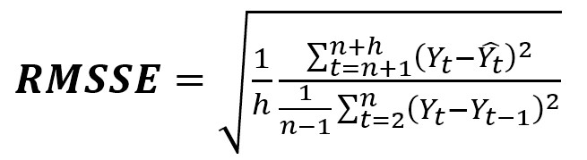

#### Kaggle Competition

# M5 Forecasting - Accuracy

## Estimate the unit sales of Walmart retail goods

## 1. 개요

월마트의 판매량을 예측하는 대회

*Can you estimate, as precisely as possible, the point forecasts of the unit sales of various products sold in the USA by Walmart?*

https://www.kaggle.com/c/m5-forecasting-accuracy/overview/

## 2. Data

In the challenge, you are predicting item sales at stores in various locations for two 28-day time periods. Information about the data is found in the [M5 Participants Guide](https://mofc.unic.ac.cy/m5-competition/).

### Files

**File 1: calendar.csv** 

Contains information about the dates the products are sold.

- *date*: The date in a “y-m-d” format.
- *wm_yr_wk*: The id of the week the date belongs to. (주차별 id: 주 마다 바뀌는 id)
- *weekday*: The type of the day (Saturday, Sunday, …, Friday).
- *wday*: The id of the weekday, starting from Saturday. (토1, 금7)
- *month*: The month of the date.
- *year*: The year of the date.
- *event_name_1*: If the date includes an event, the name of this event.
  (ex. SuperBowl, ValentinesDay)
- *event_type_1*: If the date includes an event, the type of this event.
  (ex. Sporting, Cultural)
- *event_name_2*: If the date includes a second event, the name of this event.
  ex. 한 날에 이벤트가 2개 있는 경우. 따라서 거의 다 na 값임. 4/24일 참조. Easter
- *event_type_2*: If the date includes a second event, the type of this event.
  ex. 4/24일 참조. Cultural
- *snap_CA*, *snap_TX*, and *snap_WI*: A binary variable (0 or 1) indicating whether the stores of CA, TX or WI allow SNAP[[1\]](#_ftn1) purchases on the examined date. 1 indicates that SNAP purchases are allowed.
  미국 SNAP(식량지원 프로그램)에 따라 구입이 가능할 날짜.

------

[[1\]](#_ftnref1) The United States federal government provides a nutrition assistance benefit called the Supplement Nutrition Assistance Program (SNAP). SNAP provides low income families and individuals with an Electronic Benefits Transfer debit card to purchase food products. In many states, the monetary benefits are dispersed to people across 10 days of the month and on each of these days 1/10 of the people will receive the benefit on their card. More information about the SNAP program can be found here: https://www.fns.usda.gov/snap/supplemental-nutrition-assistance-program

- `calendar.csv` - Contains information about the dates on which the products are sold.
- `sales_train_validation.csv` - Contains the historical daily unit sales data per product and store `[d_1 - d_1913]`
- `sample_submission.csv` - The correct format for submissions. Reference the [Evaluation](https://www.kaggle.com/c/m5-forecasting-accuracy/overview/evaluation) tab for more info.
- `sell_prices.csv` - Contains information about the price of the products sold per store and date.
- *`sales_train_evaluation.csv` - Available once month before competition deadline. Will include sales `[d_1 - d_1941]`*

## 3. Evaluation(평가)

The accuracy of the point forecasts will be evaluated using the **Root** **Mean Squared Scaled Error** (**RMSSE**), which is a variant of the well-known Mean Absolute Scaled Error (MASE) proposed by Hyndman and Koehler (2006)[[1\]](#_ftn1). The measure is calculated for each series as follows:

------

[[1\]](#_ftnref1) R. J. Hyndman & A. B. Koehler (2006). Another look at measures of forecast accuracy. International Journal of Forecasting 22(4), 679-688.

## 4. Preprocessing (데이터 전처리)

## 5. Result (결과)

